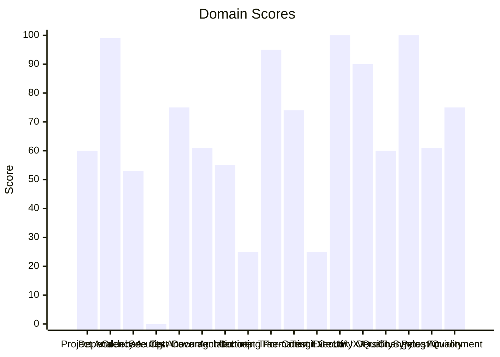

# 🔬 Code Enhancement Report

> **Generated**: 2026-05-01 00:58:13 UTC | **Target**: agent-terminal-ui | **Overall GPA**: 1.76/4.0

---

## 📊 Executive Summary

| Domain | Grade | Score | Status |
|--------|-------|-------|--------|
| Security Analysis | 🔴 F | 0/100 | `░░░░░░░░░░░░░░░░░░░░` 0/100 |
| Concept Traceability | 🔴 F | 25/100 | `█████░░░░░░░░░░░░░░░` 25/100 |
| Test Execution | 🔴 F | 25/100 | `█████░░░░░░░░░░░░░░░` 25/100 |
| Codebase Optimization | 🔴 F | 53/100 | `██████████░░░░░░░░░░` 53/100 |
| Architecture & Design Patterns | 🔴 F | 55/100 | `███████████░░░░░░░░░` 55/100 |
| Project Analysis | 🟠 D | 60/100 | `████████████░░░░░░░░` 60/100 |
| Version Sync Analysis | 🟠 D | 60/100 | `████████████░░░░░░░░` 60/100 |
| Documentation & Governance | 🟠 D | 61/100 | `████████████░░░░░░░░` 61/100 |
| Pytest Quality | 🟠 D | 61/100 | `████████████░░░░░░░░` 61/100 |
| Pre-Commit Compliance | 🟡 C | 74/100 | `██████████████░░░░░░` 74/100 |
| Test Coverage | 🟡 C | 75/100 | `███████████████░░░░░` 75/100 |
| Environment Variables | 🟡 C | 75/100 | `███████████████░░░░░` 75/100 |
| UI/UX Quality | 🟢 A | 90/100 | `██████████████████░░` 90/100 |
| Linting & Formatting | 🟢 A | 95/100 | `███████████████████░` 95/100 |
| Dependency Audit | 🟢 A | 99/100 | `███████████████████░` 99/100 |
| Directory Organization | 🟢 A | 100/100 | `████████████████████` 100/100 |
| Changelog Audit | 🟢 A | 100/100 | `████████████████████` 100/100 |

---

## 📋 Domain Scorecards

### Project Analysis — 🟠 Grade: D (60/100)

`████████████░░░░░░░░` 60/100

> [!WARNING]
> Detected ecosystem marker: agent-utilities → Agent-Utilities Ecosystem

| Criterion | Points | Evidence | Reasoning |
|-----------|--------|----------|-----------|
| has_pyproject | 10 | `pyproject.toml and requirements.txt` | Both pyproject.toml and requirements.txt exist, fulfilling mandatory Python proj |
| project_type_detected | 10 | `Agent-Utilities Ecosystem` | Identified 1 ecosystem marker(s) in dependencies |
| externalized_prompts | 0 | `<repository-root>` | No prompts/ directory found. Prompts may be hardcoded in source. |
| observability | 0 | `dependency list` | No observability tools (logfire, sentry, opentelemetry) found |
| testing_suite | 10 | `tests dir: True, pytest dep: True` | Tests directory exists, pytest in dependencies |
| agents_md | 10 | `<repository-root>/AGENTS` | AGENTS.md exists with comprehensive content |
| pre_commit_hooks | 10 | `<repository-root>/.pre-c` | Pre-commit configuration found for automated code quality checks |
| gitignore | 10 | `<repository-root>/.gitig` | .gitignore exists to prevent committing build artifacts and secrets |
| env_template | 0 | `<repository-root>` | No .env.example or .env.template — may hinder developer onboarding |
| protocol_support | 0 | `file scan` | No A2A, ACP, or MCP protocol support detected |

---

### Dependency Audit — 🟢 Grade: A (99/100)

`███████████████████░` 99/100

| Criterion | Points | Evidence | Reasoning |
|-----------|--------|----------|-----------|
| dependency_freshness | 99 | `source=<repository-root>` | Audited 9 deps (9 installed, 0 constraint-only). 0 major, 0 minor, 1 patch update |

---

### Codebase Optimization — 🔴 Grade: F (53/100)

`██████████░░░░░░░░░░` 53/100

> [!CAUTION]
> 33 functions exceed 50 lines

| Criterion | Points | Evidence | Reasoning |
|-----------|--------|----------|-----------|
| code_quality | 53 | `{"file_count": 42, "total_lines": 13923, "function_count": 8` | Analyzed 42 files, 813 functions. Avg CC=2.8, max length=129, duplication=1.9%,  |

**Findings:**
- Monolithic: commands.py (1937L) — 3 functions with high complexity (worst: CommandProcessor.cmd_prompts at 85L, CC=17); God class: CommandProcessor (80 methods) — consider mixins/composition
- Monolithic: client.py (988L) — 2 functions with high complexity (worst: AgentClient.stream at 100L, CC=19); God class: AgentClient (54 methods) — consider mixins/composition
- Monolithic: app.py (1115L) — 2 functions with high complexity (worst: AgentApp.on_agent_event_received at 81L, CC=20); God class: AgentApp (43 methods) — consider mixins/composition
- Needs attention: text_universal_skills.py (608L) — 5 functions with high complexity (worst: TestUniversalSkillsIntegration.test_yaml_frontmatter_parsing at 99L, CC=21)

---

### Security Analysis — 🔴 Grade: F (0/100)

`░░░░░░░░░░░░░░░░░░░░` 0/100

> [!CAUTION]
> 225 MEDIUM severity vulnerabilities found

| Criterion | Points | Evidence | Reasoning |
|-----------|--------|----------|-----------|
| security_posture | 0 | `high=0 med=225 low=28 attack_surface={"subprocess_calls": 0,` | Scanned 294 files. Found 253 security findings. High: -0pts, Med: -1800pts, Low: |

---

### Test Coverage — 🟡 Grade: C (75/100)

`███████████████░░░░░` 75/100

> [!NOTE]
> 67 tests without assertions

| Criterion | Points | Evidence | Reasoning |
|-----------|--------|----------|-----------|
| test_coverage_quality | 75 | `{"test_file_count": 16, "test_count": 375, "source_file_coun` | 375 tests across 16 files. Ratio: 1.28. Intent: {'unit': 373, 'smoke': 1, 'integ |

**Findings:**
- 6 potential doc-test drift items

---

### Documentation & Governance — 🟠 Grade: D (61/100)

`████████████░░░░░░░░` 61/100

> [!WARNING]
> README.md missing sections: overview, installation

| Criterion | Points | Evidence | Reasoning |
|-----------|--------|----------|-----------|
| documentation_quality | 61 | `{"README.md": {"exists": true, "missing": ["overview", "inst` | Audited 6 standard docs + docs/ directory. 1 broken references, 4 docs present.  |

**Findings:**
- README.md is short (162 lines) — consider expanding
- README missing: Has a Table of Contents
- README missing: Has installation instructions
- README missing: Has architecture overview or diagram

---

### Architecture & Design Patterns — 🔴 Grade: F (55/100)

`███████████░░░░░░░░░` 55/100

> [!CAUTION]
> SRP: 70 modules exceed 500 lines (god modules)

| Criterion | Points | Evidence | Reasoning |
|-----------|--------|----------|-----------|
| architecture_quality | 55 | `{"layers": 0, "di_ratio": 0.03, "solid_violations": 2}` | Analyzed 294 files. 0/5 architecture layers present, DI ratio: 3%, 2 SOLID viola |

**Findings:**
- SRP: 21 classes have >15 methods
- No discernible layer architecture (no domain/service/adapter separation)
- Low dependency injection ratio: 3%
- 26 Python files at top level — consider package organization

---

### Concept Traceability — 🔴 Grade: F (25/100)

`█████░░░░░░░░░░░░░░░` 25/100

> [!CAUTION]
> Low traceability ratio: 0% concepts fully traced

| Criterion | Points | Evidence | Reasoning |
|-----------|--------|----------|-----------|
| concept_traceability | 25 | `{"total_concepts": 6, "well_traced": 0, "orphans": 6, "drift` | 6 unique concepts found. 0 fully traced (code+docs+tests), 6 orphans, 0 drifted. |

**Findings:**
- 6 orphaned concepts (only in one source)
- 375 test functions missing concept markers
- 142 significant functions (>10 lines) missing concept markers in docstrings

---

### Linting & Formatting — 🟢 Grade: A (95/100)

`███████████████████░` 95/100

> [!TIP]
> Total lint findings: 3 (high/error: 0, medium/warning: 2, low: 1)

| Criterion | Points | Evidence | Reasoning |
|-----------|--------|----------|-----------|
| lint_compliance | 95 | `ruff=1, bandit=0, mypy=2` | 3 total findings across 3 tools. High/error: -0pts, Med/warning: -4pts, Low: -1p |

---

### Pre-Commit Compliance — 🟡 Grade: C (74/100)

`██████████████░░░░░░` 74/100

> [!NOTE]
> 4/20 pre-commit hooks failed: don't commit to branch, ruff check, bandit, uv-lock

| Criterion | Points | Evidence | Reasoning |
|-----------|--------|----------|-----------|
| precommit_compliance | 74 | `{"total_hooks": 20, "passed": 15, "failed": 4, "skipped": 1,` | Ran pre-commit with 20 hooks: 15 passed, 4 failed, 1 skipped. 2 potentially outd |

**Findings:**
- 2 hook(s) may be outdated: ruff-pre-commit, uv-pre-commit
- Pytest hooks skipped (handled by CE-016 Test Execution): local-pytest, pytest

---

### Test Execution — 🔴 Grade: F (25/100)

`█████░░░░░░░░░░░░░░░` 25/100

> [!CAUTION]
> No tests were executed (test framework detected but no tests found)

| Criterion | Points | Evidence | Reasoning |
|-----------|--------|----------|-----------|
| test_execution | 25 | `{"frameworks_detected": 1, "total_passed": 0, "total_failed"` | Executed 1 framework(s). 0 passed, 0 failed, 0 errors. Pass rate: 0%. |

---

### Directory Organization — 🟢 Grade: A (100/100)

`████████████████████` 100/100

| Criterion | Points | Evidence | Reasoning |
|-----------|--------|----------|-----------|
| directory_organization | 100 | `{"total_source_files": 72, "total_directories": 13, "max_dep` | 72 files across 13 directories. Max depth: 3, avg files/dir: 5.5. 0 crowded, 0 s |

---

### UI/UX Quality — 🟢 Grade: A (90/100)

`██████████████████░░` 90/100

> [!TIP]
> Failed heuristic 'match_real_world': Help text in CLI arguments: False

| Criterion | Points | Evidence | Reasoning |
|-----------|--------|----------|-----------|
| ui_heuristics_terminal | 90 | `{"ui_type": "terminal", "files_analyzed": 42, "heuristics_pa` | TERMINAL UI detected. 9/10 Nielsen heuristics pass. Analyzed 42 terminal files. |

---

### Version Sync Analysis — 🟠 Grade: D (60/100)

`████████████░░░░░░░░` 60/100

> [!WARNING]
> Found 2 file(s) with version '0.2.0' that are NOT tracked in .bumpversion.cfg:

| Criterion | Points | Evidence | Reasoning |
|-----------|--------|----------|-----------|
| bumpversion_exists | 20 | `<repository-root>/.bumpv` | .bumpversion.cfg found |
| current_version_defined | 20 | `0.2.0` | Current version tracked is 0.2.0 |
| files_tracked | 20 | `1 files tracked` | Found 1 files tracked in .bumpversion.cfg |
| version_drift_check | 0 | `2 untracked files` | Version definitions found in codebase that are missing from .bumpversion.cfg |

**Findings:**
-   - .specify/reports/results.json
-   - .specify/reports/code_enhancement_report.md

---

### Changelog Audit — 🟢 Grade: A (100/100)

`████████████████████` 100/100

| Criterion | Points | Evidence | Reasoning |
|-----------|--------|----------|-----------|
| changelog_quality | 100 | `{"exists": true, "parseable": true, "version_count": 1, "has` | CHANGELOG.md exists. 1 versions tracked. 0 dependency changelogs analyzed. |

---

### Pytest Quality — 🟠 Grade: D (61/100)

`████████████░░░░░░░░` 61/100

> [!WARNING]
> 5 test files exceed 500 lines — split into focused modules

| Criterion | Points | Evidence | Reasoning |
|-----------|--------|----------|-----------|
| pytest_quality | 61 | `{"test_files": 16, "total_tests": 375, "descriptive_name_rat` | 375 tests across 16 files. Naming: 20/20, Structure: 0/20, Fixtures: 16/20, Asse |

**Findings:**
- 4 test files have >30 tests — too dense
- Test directory lacks subdirectory organization (consider unit/, integration/, e2e/)
- Missing conftest.py for shared fixtures
- No shared fixtures in conftest.py

---

### Environment Variables — 🟡 Grade: C (75/100)

`███████████████░░░░░` 75/100

> [!NOTE]
> Partial env var documentation: 50% coverage

| Criterion | Points | Evidence | Reasoning |
|-----------|--------|----------|-----------|
| env_var_documentation | 75 | `{"total_vars": 4, "python_vars": 4, "dockerfile_vars": 0, "c` | Found 4 unique env vars across 28 occurrences. README documents 2/4. Missing .en |

**Findings:**
- Undocumented env vars: AGENT_LOG_FILE, AGENT_THEME
- No .env.example file — create one for developer onboarding

---

## 🎯 Prioritized Action Items

| # | Priority | Domain | Action | Impact | Risk |
|---|----------|--------|--------|--------|------|
| 1 | 🔴 High | Codebase Optimization | 33 functions exceed 50 lines | High | High |
| 2 | 🔴 High | Codebase Optimization | Monolithic: commands.py (1937L) — 3 functions with high complexity (worst: Comma | High | High |
| 3 | 🔴 High | Codebase Optimization | Monolithic: client.py (988L) — 2 functions with high complexity (worst: AgentCli | High | High |
| 4 | 🔴 High | Codebase Optimization | Monolithic: app.py (1115L) — 2 functions with high complexity (worst: AgentApp.o | High | High |
| 5 | 🔴 High | Codebase Optimization | Needs attention: text_universal_skills.py (608L) — 5 functions with high complex | High | High |
| 6 | 🔴 High | Codebase Optimization | Needs attention: input_text_area.py (692L) — 1 functions with high complexity (w | High | High |
| 7 | 🔴 High | Codebase Optimization | 19 functions with nesting depth >4 | High | High |
| 8 | 🔴 High | Security Analysis | 225 MEDIUM severity vulnerabilities found | High | High |
| 9 | 🔴 High | Architecture & Design Patterns | SRP: 70 modules exceed 500 lines (god modules) | High | High |
| 10 | 🔴 High | Architecture & Design Patterns | SRP: 21 classes have >15 methods | High | High |
| 11 | 🔴 High | Architecture & Design Patterns | No discernible layer architecture (no domain/service/adapter separation) | High | High |
| 12 | 🔴 High | Architecture & Design Patterns | Low dependency injection ratio: 3% | High | High |
| 13 | 🔴 High | Architecture & Design Patterns | 26 Python files at top level — consider package organization | High | High |
| 14 | 🔴 High | Concept Traceability | Low traceability ratio: 0% concepts fully traced | High | High |
| 15 | 🔴 High | Concept Traceability | 6 orphaned concepts (only in one source) | High | High |
| 16 | 🔴 High | Concept Traceability | 375 test functions missing concept markers | High | High |
| 17 | 🔴 High | Concept Traceability | 142 significant functions (>10 lines) missing concept markers in docstrings | High | High |
| 18 | 🔴 High | Test Execution | No tests were executed (test framework detected but no tests found) | High | High |
| 19 | 🔴 High | Project Analysis | Detected ecosystem marker: agent-utilities → Agent-Utilities Ecosystem | High | Medium |
| 20 | 🔴 High | Documentation & Governance | README.md missing sections: overview, installation | High | Medium |
| 21 | 🔴 High | Documentation & Governance | README.md is short (162 lines) — consider expanding | High | Medium |
| 22 | 🔴 High | Documentation & Governance | README missing: Has a Table of Contents | High | Medium |
| 23 | 🔴 High | Documentation & Governance | README missing: Has installation instructions | High | Medium |
| 24 | 🔴 High | Documentation & Governance | README missing: Has architecture overview or diagram | High | Medium |
| 25 | 🔴 High | Documentation & Governance | README missing: References /docs directory material | High | Medium |
| 26 | 🔴 High | Documentation & Governance | AGENTS.md missing sections: tech stack, commands, project structure | High | Medium |
| 27 | 🔴 High | Documentation & Governance | No LICENSE file found | High | Medium |
| 28 | 🔴 High | Version Sync Analysis | Found 2 file(s) with version '0.2.0' that are NOT tracked in .bumpversion.cfg: | High | Medium |
| 29 | 🔴 High | Version Sync Analysis |   - .specify/reports/results.json | High | Medium |
| 30 | 🔴 High | Version Sync Analysis |   - .specify/reports/code_enhancement_report.md | High | Medium |

---

## 🔄 SDD Handoff

Run `generate_sdd_handoff.py` with this report's JSON data to produce
structured TODO items compatible with the `spec-generator` → `task-planner` →
`sdd-implementer` pipeline. Output will be saved to `.specify/specs/`.
