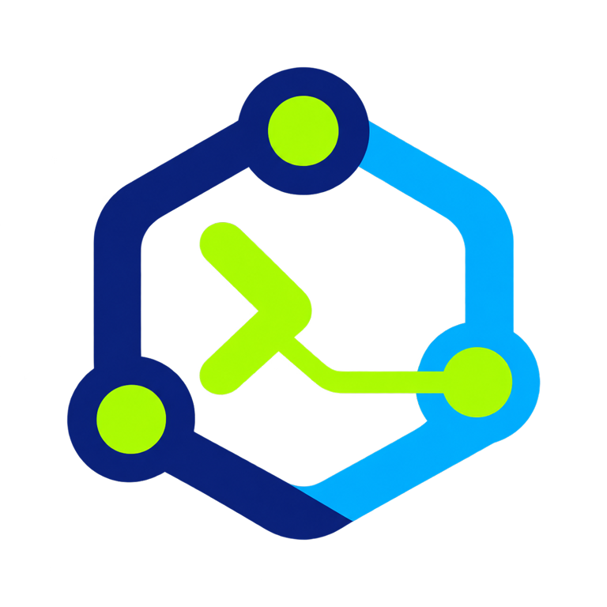

# Agent Terminal UI

<p align="center"></p>

<p align="center"><strong>A terminal interface for agent sessions and Graph OS capabilities.</strong><br><sub>Inspect work, invoke governed tools, and manage sessions from Textual.</sub></p>

[](https://pypi.org/project/agent-terminal-ui/) [](https://pypi.org/project/agent-terminal-ui/) [](https://pypi.org/project/agent-terminal-ui/) [](https://pypi.org/project/agent-terminal-ui/) [](https://pypi.org/project/agent-terminal-ui/)

[](https://github.com/Knuckles-Team/agent-terminal-ui) [](https://github.com/Knuckles-Team/agent-terminal-ui) [](https://github.com/Knuckles-Team/agent-terminal-ui) [](agent_terminal_ui/LICENSE) [](https://github.com/Knuckles-Team/agent-terminal-ui/commits/main)

[](https://github.com/Knuckles-Team/agent-terminal-ui/pulls) [](https://github.com/Knuckles-Team/agent-terminal-ui/pulls?q=is%3Apr+is%3Aclosed) [](https://github.com/Knuckles-Team/agent-terminal-ui/issues) [](https://github.com/Knuckles-Team/agent-terminal-ui) [](https://github.com/Knuckles-Team/agent-terminal-ui) [](https://github.com/Knuckles-Team/agent-terminal-ui) [](https://github.com/Knuckles-Team/agent-terminal-ui)

[](https://knuckles-team.github.io/agent-terminal-ui/)

<p align="center"><a href="https://knuckles-team.github.io/agent-terminal-ui/">Documentation</a> · <a href="https://knuckles-team.github.io/agent-terminal-ui/capabilities/">Capabilities</a> · <a href="https://knuckles-team.github.io/agent-terminal-ui/interfaces/">Interfaces</a> · <a href="https://knuckles-team.github.io/agent-terminal-ui/status/">Status</a></p>

## Overview

Agent Terminal UI is a Textual frontend for interactive and headless agent sessions. It uses Graph OS REST APIs for live capability discovery and invocation, run inspection, and dashboard data. Its ACP-style chat transport is separate and requires a compatible endpoint.

## Key capabilities

- Interactive terminal sessions and lightweight headless runs.
- Live capability search, schema-generated forms, and governed invocation through Graph OS.
- Run inspection with event replay, cursor tracking, and approval resumption.
- Durable local sessions and workspace snapshots, background tasks, slash commands, tool approvals, and a dynamic workflow sidebar.

## Documentation

- [Documentation home](https://knuckles-team.github.io/agent-terminal-ui/)
- [Capabilities](https://knuckles-team.github.io/agent-terminal-ui/capabilities/)
- [Interfaces](https://knuckles-team.github.io/agent-terminal-ui/interfaces/)
- [Status](https://knuckles-team.github.io/agent-terminal-ui/status/)
- [Architecture](docs/architecture.md)
- [Configuration](docs/configuration.md)
- Core projects: [Epistemic Graph](https://knuckles-team.github.io/epistemic-graph/), [Agent Utilities](https://knuckles-team.github.io/agent-utilities/), [Graph OS](https://knuckles-team.github.io/graph-os/), [Agent Connector SDK](https://knuckles-team.github.io/agent-connector-sdk/), and [Agent Web UI](https://knuckles-team.github.io/agent-webui/).

## Architecture


Graph OS serves the REST capability, run, and dashboard surfaces used by this client. The main chat path uses this repository's HTTP/SSE ACP-style transport, which the current Graph OS deployment does not mount. A compatible ACP endpoint is required for chat; this project does not use Zed's ACP SDK.

## Quick start

Install and launch with Python 3.11–3.14:

```bash
python -m pip install agent-terminal-ui
agent-terminal-ui
```

Set `AGENT_URL` to the Graph OS API and `ACP_URL` to a compatible ACP endpoint before using chat. See [Configuration](docs/configuration.md) for settings.

## Contributing

Issues and pull requests are welcome in the [Agent Terminal UI repository](https://github.com/Knuckles-Team/agent-terminal-ui).

## License

Agent Terminal UI is released under the [MIT License](agent_terminal_ui/LICENSE).
