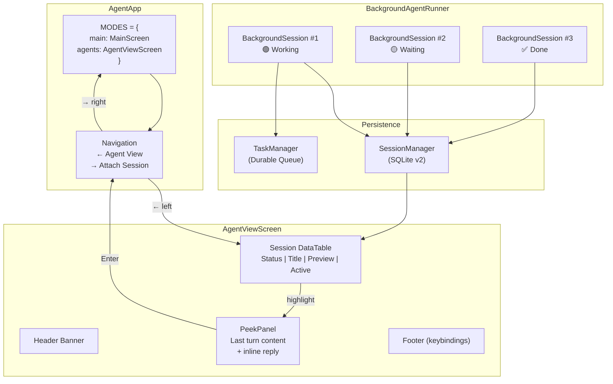

# Agent View — Multi-Session Dashboard

> **Concept:** TUI-20 (Agent View)
> **Status:** Implemented
> **Package:** `agent-terminal-ui`

## Overview

Agent View is a dedicated Textual screen for managing all concurrent agent
sessions from one place. Inspired by Claude Code's agent view, it provides
at-a-glance status for every running session, peek-and-reply workflows, and
background session management.

## Architecture



## Session Status Indicators

| Icon | Status | Meaning |
|------|--------|---------|
| 🟢 | Working | Agent is actively executing |
| 🟡 | Waiting | Agent needs user input |
| ✅ | Done | Session completed successfully |
| ❌ | Failed | Session encountered an error |
| 🚫 | Cancelled | Session was cancelled by user |

## Session Types

| Icon | Type | Description |
|------|------|-------------|
| 💬 | Chat | Regular conversation session |
| 🎯 | Goal | Autonomous `/goal` session |

## Usage

### Opening Agent View

```
/agents          # Slash command
← (left arrow)   # Keyboard shortcut from any session
```

### Navigation

| Key | Action |
|-----|--------|
| `↑` / `↓` | Navigate session list |
| `Enter` / `→` | Attach to selected session |
| `n` | Create new session |
| `d` | Delete/archive selected session |
| `r` | Reply inline (if session is waiting) |
| `Escape` | Return to current session |

### Backgrounding Sessions

```bash
# Background the current session
/bg

# Start a new session in background
agent-terminal-ui --bg --prompt "run the test suite"

# Attach to a specific session
/attach <session_id>
```

## Components

### AgentViewScreen

The main Textual `Screen` that renders the dashboard. Composed of:
- **Header**: Title banner ("🤖 Agent View — All Sessions")
- **DataTable**: Scrollable session list with status, title, preview, timing
- **PeekPanel**: Detail view of the selected session's last response
- **Footer**: Context-sensitive keybinding hints

### PeekPanel

Shows the last turn of the highlighted session without switching context.
When a session has `needs_input=True`, the panel shows a reply indicator
and pressing `r` or `Enter` attaches directly for response.

### BackgroundAgentRunner

Manages sessions running as async workers within the TUI process:
- Tracks up to 10 concurrent background sessions
- Persists state after each iteration for crash recovery
- Buffers output for peek via the Agent View
- Supports cancel, status query, and cleanup

### AgentSessionRow

In-memory data class powering each table row:
```python
class AgentSessionRow:
    session_id: str
    title: str
    status: str       # working | waiting | done | failed
    last_response: str
    last_activity: float
    needs_input: bool
    background: bool
    goal_id: str       # Links to GoalNode in KG
```

## Schema v2 Migration

The `SessionManager` database automatically migrates from v1 → v2 on startup,
adding columns needed by Agent View:

| Column | Type | Purpose |
|--------|------|---------|
| `background` | INTEGER | Whether session is running in background |
| `needs_input` | INTEGER | Whether session needs user input |
| `last_response_preview` | TEXT | Truncated last assistant response |
| `goal_id` | TEXT | Linked GoalNode ID for goal sessions |

## Slash Commands

| Command | Description |
|---------|-------------|
| `/agents` | Open Agent View dashboard |
| `/bg` | Background the current session |
| `/attach <id>` | Attach to a specific session |
| `/goal <text>` | Start an autonomous goal session |

## CLI Flags

```bash
agent-terminal-ui --bg                    # Start in Agent View mode
agent-terminal-ui --bg --prompt "task"    # Background a specific task
agent-terminal-ui --override              # Auto-approve mode (for goals)
```

## Files

| File | Purpose |
|------|---------|
| `screens/agent_view.py` | AgentViewScreen + PeekPanel + AgentSessionRow |
| `screens/agent_view.tcss` | Styling for the Agent View |
| `background_runner.py` | BackgroundAgentRunner + BackgroundSession |
| `widgets/goal_status.py` | GoalStatusWidget for inline goal display |
| `session_manager.py` | Schema v2 migration |
| `commands.py` | `/agents`, `/bg`, `/attach` registration |
| `app.py` | MODES + navigation bindings |
| `terminal_ui.py` | `--bg` CLI flag |
