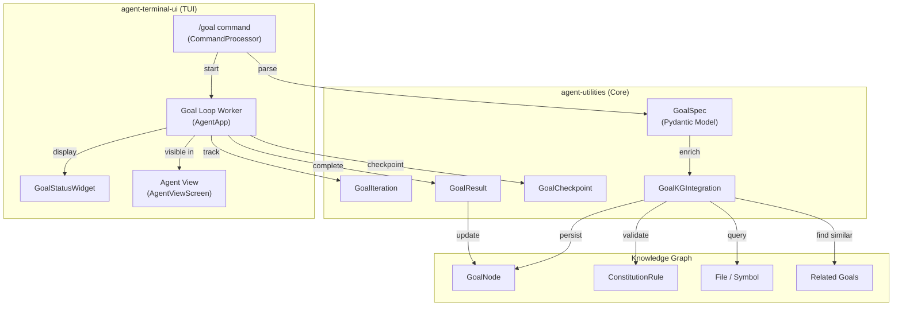

# `/goal` Command — Autonomous Goal Loop

> **Concept:** ORCH-5.0 (Autonomous Goal Loop)
> **Status:** Implemented
> **Package:** `agent-utilities` (models) + `agent-terminal-ui` (TUI integration)

## Overview

The `/goal` command puts the agent into an autonomous execution loop where it
works iteratively toward a measurable end-state without manual intervention.
The agent plans, executes, validates, and re-plans until the objective is met
or the maximum iteration count is reached.

This is the equivalent of a "24/7 AI employee" — define the goal, set the
constraints, and let the agent work autonomously.

## Architecture



## Usage

### Basic Syntax

```
/goal <objective> [until <end_state>] [without <constraints>]
```

### Examples

```bash
# Simple goal
/goal fix the README formatting

# Goal with success criteria
/goal fix failing tests until pytest passes

# Goal with validation command
/goal fix every failing test until npm test exits 0

# Goal with constraints
/goal refactor auth module until all tests pass without modifying the API contract

# Complex goal
/goal optimize database queries until p95 latency < 100ms without changing the schema, removing indexes
```

### Subcommands

| Command | Description |
|---------|-------------|
| `/goal <text>` | Start a new autonomous goal |
| `/goal:status` | Show current goal progress |
| `/goal:cancel` | Cancel the active goal |
| `/goal:history` | Browse past goals (from KG) |

## KG-Native Integration

Goals are **first-class Knowledge Graph nodes** (`GoalNode`). This enables:

### Context Enrichment
When a goal is parsed, the system queries the KG for relevant codebase context
(files, symbols, modules) and injects it into the goal specification. This gives
the agent awareness of the codebase structure before it starts working.

### Rule Validation
Goals are validated against `ConstitutionRule` and `Policy` nodes in the KG to
ensure they don't violate governance constraints. For example, a constitution
rule like "never delete production data" would surface as a constraint on any
goal that touches database operations.

### Historical Leverage
Prior `GoalNode` executions are queryable. When a new goal is created, the
system searches for similar past goals and their outcomes, enabling pattern
reuse and learning from past successes/failures.

### Durable Persistence
Goal state is checkpointed as `GoalCheckpoint` objects using the KG's
`StateCheckpointer` (CONCEPT:KG-2.6). If the process crashes mid-goal,
the goal loop can be resumed from the last checkpoint.

## Data Models

### GoalSpec

The primary model parsed from user input:

```python
class GoalSpec(BaseModel):
    id: str                    # Unique goal ID (KG node_id)
    objective: str             # "fix failing tests"
    end_state: str             # "npm test exits 0"
    constraints: list[str]     # ["modifying /auth"]
    validation_cmd: str        # "npm test"
    max_iterations: int = 20
    auto_approve: bool = True
    session_id: str

    # KG-Native fields
    kg_context: list[str]      # Codebase context from KG
    kg_rules: list[str]        # Constitution rules
    related_goals: list[str]   # Prior goal IDs
    kg_node_type: str = "GoalNode"
```

### GoalIteration

Tracks each iteration of the autonomous loop:

```python
class GoalIteration(BaseModel):
    iteration: int
    action: str
    result: str
    validation_output: str
    is_complete: bool
    duration_ms: int
    tool_calls: int
```

### GoalResult

Final summary when a goal completes:

```python
class GoalResult(BaseModel):
    goal_id: str
    status: GoalStatus  # completed | failed | cancelled
    iterations: list[GoalIteration]
    total_iterations: int
    total_duration_ms: int
    total_tool_calls: int
    summary: str
```

## Execution Flow

1. **Parse**: User input is parsed into a `GoalSpec` via regex patterns
2. **Enrich**: `GoalKGIntegration.enrich_from_kg()` adds codebase context
3. **Validate**: `GoalKGIntegration.validate_against_rules()` checks constitution
4. **Persist**: `GoalKGIntegration.persist_goal()` stores as `GoalNode` in KG
5. **Loop**: Agent works autonomously with `auto_approve=True`
6. **Checkpoint**: Each iteration is checkpointed for crash recovery
7. **Validate**: If `validation_cmd` is set, the agent runs it to check completion
8. **Report**: `GoalResult.to_report()` generates a markdown summary

## Keyboard Shortcuts

| Key | Action |
|-----|--------|
| `Ctrl+G` | Cancel active goal |
| `←` | Switch to Agent View (see goal in dashboard) |

## Files

| File | Package | Purpose |
|------|---------|---------|
| `agent_utilities/models/goal.py` | agent-utilities | Core models + KG integration |
| `agent_terminal_ui/commands.py` | agent-terminal-ui | `/goal` command registration |
| `agent_terminal_ui/widgets/goal_status.py` | agent-terminal-ui | Live status widget |
